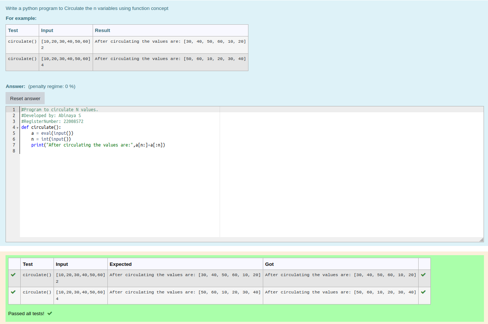

# Circulate-the-values-of-N-variables
## Aim:
To write a python program to circulate the n variables using function concept
## Equipment’s required:
PC
Anaconda - Python 3.7
## Algorithm: 
### Step 1: 
define the function circulate.
### Step 2: 
To calculate, enter the formula.
### Step 3: 
Get the value from the user for the number of rotation
### Step 4: 
Using the slicing concept rotate the list
### Step 5: 
print the values after circulating.
### Step 6: 
end the program.
## Program:
```
#Program to circulate N values.
#Developed by: Abinaya S
#RegisterNumber: 22008572
def circulate():
    a = eval(input())
    n = int(input())
    print("After circulating the values are:",a[n:]+a[:n])
```

## Output:


## Result:
Thus, a python program to circulate the n variables using function concept is successfully executed and displayed.